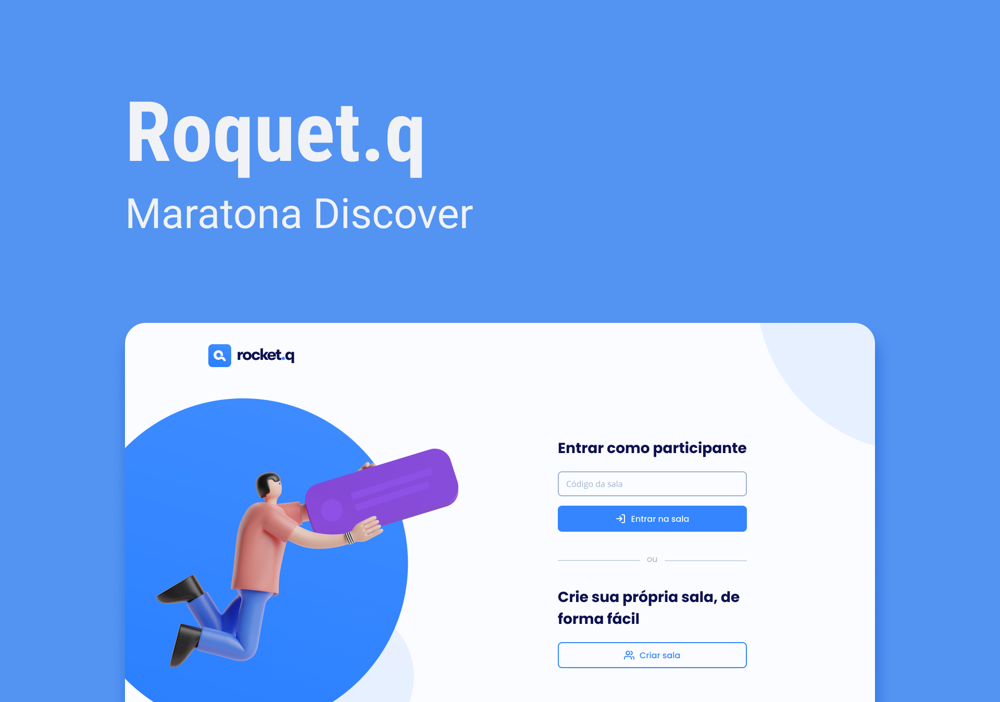

<h1>NLW Together Discover pela Rocketseat </h1>

<h2> Rocket.Q </h2>

<strong>Tecnologias Usadas no Projeto</strong>

<ul>

<li>Html</li>

<li>CSS</li>

<li>JavaScript</li>

<li>Node.js</li>

<li>Banco de Dados com SQLLite</li>

<li>EJS</li>

</ul>

<strong>Aprendizado: </strong>

<ul>

<li>Como importar e exportar funções com JavaScript</li>

<li>Mapeamento de classes</li>

<li>Utilização de:</li>

<ol> 

<li>Função addEventListener</li>
<li>Operadores lógicos com JavaScript</li>
<li>Controllers e implementação de rotas</li>
<li>EJS</li>
<li>Express</li>

</ol>

<li>Como criar um Banco de Dados em SQLLite</li>

</ul>